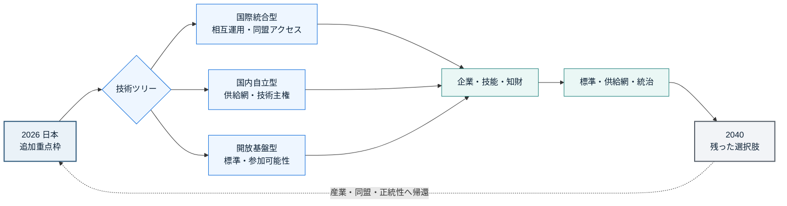
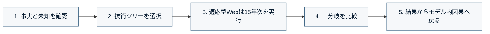

<div align="center">

# 宇宙文明の選択権

<p><strong>2026年の技術投資は、2040年の日本にどの選択肢を残すか。</strong></p>

日本の宇宙政策を起点に、技術・産業・標準・文化を一本の因果連鎖として比較する、
メタ安全保障シミュレーションです。

[](PROJECT_GOAL.md)
[](docs/adr/0002-hybrid-deterministic-llm-simulation.md)
[](PUBLIC_READY.md)
[](LICENSE)

</div>

> [!IMPORTANT]
> 現在はハッカソン用の**ローカル適応型シミュレーターMVP**です。Phase 1の決定論コアに加え、
> 20パラメータ・5主体で、適応型Webは2026〜2040年の15年次PDCA、固定比較fixtureは
> 2026 / 2030 / 2035 / 2040の4時点PDCAと因果トレースをローカル実行できます。
> BRANCH-001の三分岐完成や公開承認は未達で、政府・JAXA・主催者の公式見解ではありません。

## 目的

### 30秒でわかる

| 起点となる事件 | 比較する選択 | 観測するもの |
|---|---|---|
| 2026年、日本が宇宙技術の追加重点枠を決める | 国際統合型／国内自立型／開放基盤型 | 2040年に日本が保持・喪失した選択肢 |

問うのは「どの国が勝つか」ではありません。

> **日本は、宇宙へ行く技術だけでなく、宇宙で未来を選び直せる能力を作れているか。**



## できること

### 三つの選択は、三つの「正解」ではない

| 分岐 | 優先する能力 | 得やすいもの | 失いやすいもの |
|---|---|---|---|
| **国際統合型** | 同盟・国際計画との相互運用 | 到達速度、共同利用、外交的接続 | 独自仕様、単独変更の自由 |
| **国内自立型** | 供給網・中核技術の国内保持 | 自律性、危機耐性、技能蓄積 | 規模、速度、国際的普及 |
| **開放基盤型** | 開放標準と参加可能性 | 生態系、多様な参入、切替余地 | 統制力、短期収益、意思決定速度 |

三分岐は同じ`scenario_snapshot_hash`、`seed`、`model_version`、
`exogenous_event_stream_hash`から実行します。分岐内で生じる行動と状態遷移を含む全event logは
分岐ごとに記録し、それぞれの`event_log_hash`で同一性を検証します。結果を一つの文明スコアへ
潰さず、何を得て、何を失い、どの未来を選べなくなったかを比べます。

## メタ安全保障として何を守るか

守る対象は、月面基地や単独技術ではなく、**日本が将来の制度・技術・関係を変更できる能力**です。

| 観測軸 | 見るもの |
|---|---|
| 到達・運用 | 日本主体で必要な輸送・運用を継続できるか |
| 産業再生産 | 重要部品、ソフトウェア、技能を国内・協力圏で再生産できるか |
| ルール形成 | 標準、データ利用、参加条件の決定に関与できるか |
| 知識継承 | 次世代の技術者と組織へ知識を移せるか |
| 関係選択 | 一つの国家・企業へ固定されず協力関係を選べるか |
| 公的正統性 | 地球社会が長期投資の意味と負担を受け入れるか |

地球上の資金・知財・人材の選択が、宇宙での参加条件を変え、その結果が日本の産業・同盟・
社会的正統性へ戻る。この往復を一つの事件として観測します。

## 体験の流れ



1セッションは15〜25分を想定します。知識状態（事実、シナリオ仮説、モデル仮定、未知）と、
生成元（公式資料、学術資料、その他の第三者公開資料、人間、決定論的コア、LLM）と、検証状態を
別々に表示します。各変化はturn ID、入力、行動、規則、根拠へ遡れるようにします。

## 現在地とロードマップ

| Phase | 成果物 | 状態 |
|---|---|---|
| **0 公開設計** | ゴール、仕様、ADR、根拠台帳、安全境界 | **main公開済み／運用契約更新はreview待ち** |
| **1 決定論的fixture** | 状態schema、event log、同一seed replay | **完了条件達成（一分岐replay＋trace）** |
| **2 適応型比較** | 20入力、5主体、共通外生event、六観測軸 | **ローカルMVP実装／BRANCH-001・感度分析は残務** |
| **3 UI** | 因果盤、parameter操作、提案採否、trace | **Causal Constellation実装** |
| **4 外部provider** | schema検証された行動提案 | **後続JSON/HTTP adapterへ延期／外部接続なし** |
| **5 demo評価** | 人間レビュー、説明可能性eval | 未着手 |

適応型Webは各年に5主体の初期提案、相互応答、再提案、資源調停、状態更新を行います。
`POST /api/simulate/stream`のNDJSON eventで実計算の進行を通知し、完了後の画面遷移は
「結果リプレイ」として区別します。固定比較fixtureと`meta-security-run-bundle/v1`は4時点のままです。

Phase 1として、国内自立型の1 branch × 4 round fixtureをLLMなしで再生し、同一入力の
canonical output hash一致と六軸deltaのmodel_internal traceまで実装しました。次は同じschemaで
三技術ツリーを比較できるよう、共通外生event列とmodel cardを固定します。詳細は
[ロードマップ](docs/ROADMAP.md)を参照してください。

## 設計を読む

| 入口 | 内容 |
|---|---|
| [プロジェクト正本マップ](PROJECT_SSOT.md) | repository identity、文書ごとの正本、ローカル配置との境界 |
| [一枚設計](docs/ONE_PAGER.md) | 事件、主体、因果連鎖 |
| [プロジェクトゴール](PROJECT_GOAL.md) | スコープ、非目標、機械検査可能な完了条件 |
| [プロダクト仕様](docs/PRODUCT_SPEC.md) | 利用者、体験、成功条件 |
| [シミュレーション設計](docs/SIMULATION_DESIGN.md) | 状態、分岐、replay、証拠分類 |
| [アーキテクチャ](docs/ARCHITECTURE.md) | 決定論的coreと限定LLMの境界 |
| [研究根拠台帳](docs/RESEARCH_EVIDENCE.md) | 事実、仮説、未知、出典 |
| [既存基盤の再利用マップ](docs/REUSE_MAP.md) | Fractal Decision Ecosystem（FDE）、開発保証、GitHub Ops、公開gateの正本と採用境界 |
| [運用採用manifest](ops/adoption-manifest.json) | 採用level、固定版、証拠、drift方針の機械可読な正本 |
| [ADR一覧](docs/adr/README.md) | 採用した判断と見直し条件 |

## クイックスタート

### ローカル検査

ゴール契約、決定論コア、適応型PDCA、ローカルWebデモを検査・実行できます。
クリーンなcloneでは、CIと同じpinned依存を入れてから検査してください。

```powershell
py -3.13 -m pip install --disable-pip-version-check -r requirements-dev.txt
$env:PYTHONPATH = 'src'
py -3.13 -m pytest -q
py -3.13 scripts/check_project_goal.py --json
py -3.13 scripts/run_phase1_fixture.py
py -3.13 scripts/run_bundle.py evidence/runs/local-run-bundle.json
py -3.13 scripts/run_bundle.py --verify evidence/runs/local-run-bundle.json
Push-Location frontend
npm ci
npm run build
Pop-Location
py -3.13 scripts/run_hackathon_demo.py
py -3.13 scripts/check_operational_adoption.py --json

$ratchet = Join-Path $env:APPDATA 'Python\Python313\Scripts\ai-ratchet-gate.exe'
& $ratchet --repo .
```

fixture runnerはmanifest、4件のevent、event log hash、canonical output hash、model_internal
traceをJSONで返します。ブラウザで`http://127.0.0.1:8000`を開き、適応型シミュレーションも
実行できます。現在のMVP coreは組み込み決定論providerだけを許可し、外部AIやAPI keyは不要です。
run bundleは三分岐core eventを変更せず、各event envelopeへ同じrun ID、schema、決定論的なglobal
sequenceとhash chainを付けて保存します。ordered records全体の`event_stream_hash`と件数も証拠へ束縛します。
出力先は上書きせず、`--verify`はfixtureを再読込して既存runtimeの再実行結果と完全一致するか検査します。
外部AIは後続の別process JSON/HTTP adapterとして接続します。状態遷移の単一writerはローカル決定論コアです。
これはBRANCH-001完成、プロダクトMVP完成、公開・応募・政策提言の許可を意味しません。

## 制約

- 2040年、日本政府、企業、国際秩序を予言しない
- 軍事作戦、攻撃、情報工作を最適化しない
- 文明、国家、技術ツリーを単一総合点で序列化しない
- 実在組織・人物の非公開意図を推測しない
- LLMの文章を証拠または状態遷移の正本にしない
- 人間の価値判断を自動的な政策提言へ置き換えない

## 公式情報

- [AIエージェント社会シミュレーションハッカソン Vol.2](https://hackathon.automata-lab.jp/)
- [メタ安全保障 — 概念解説とハッカソン課題の発想集](https://prtimes.jp/a/?f=d80352-184-caedebb354dd205d5811c599da74761b.pdf)
- [JAXA 宇宙戦略基金](https://fund.jaxa.jp/about/)
- [JAXA 宇宙戦略基金「探査等」](https://fund.jaxa.jp/techfield/probe/)
- [JAXA「有人与圧ローバー」](https://humans-in-space.jaxa.jp/biz-lab/tech/pressurized-rover/)
- [内閣府「宇宙基本計画」](https://www8.cao.go.jp/space/plan/keikaku.html)

取得日と主張の分類は[研究根拠台帳](docs/RESEARCH_EVIDENCE.md)へ記録します。最新要件は各公式サイトを
正としてください。

## ガバナンスと公開境界

- goal ID: `space-civilization-choice-mvp-v1`
- owner: `repository-maintainers`
- 正本マップ: [PROJECT_SSOT.md](PROJECT_SSOT.md)
- product goal正本: [PROJECT_GOAL.md](PROJECT_GOAL.md)
- 公開判定: [PUBLIC_READY.md](PUBLIC_READY.md)
- セキュリティ報告: [SECURITY.md](SECURITY.md)

第三者の文書本体、内部資料、非公開log、応募フォーム回答、個人情報は収録しません。
repo独自のコードと文書は[MIT License](LICENSE)で提供し、リンク先資料には各権利条件が適用されます。
