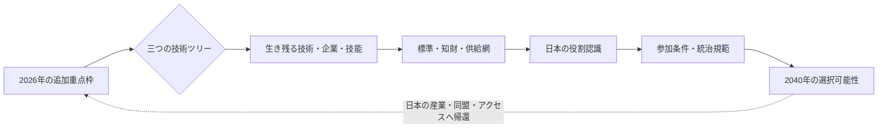

# 宇宙文明の選択権

**2026年の技術投資は、2040年の日本を宇宙秩序のどこに置くか。**

日本の現在の宇宙政策と技術開発を出発点に、技術ツリー、産業構造、国際標準、
人材継承が長期的にどう連鎖するかを比較する、メタ安全保障シミュレーションの公開設計です。

> 日本は、宇宙へ行く技術だけでなく、宇宙で自分たちの未来を選べる能力を作れているか。

ここでいう「文明選択権」とは、将来の日本由来社会が、他国や巨大企業の技術・制度へ
完全従属せず、技術、統治、文化、対外関係を自ら選べる余地です。月面文明の完成を
予定されたゴールにはせず、その可能性を残す能力を観測します。

状態は **ハッカソン応募候補／設計中／未実装／政府・主催者の公式見解ではない** です。

## ガバナンス

- goal ID: `space-civilization-choice-mvp-v1`
- owner: `repository-maintainers`
- ゴール、スコープ、非目標、完了条件の正本: [`PROJECT_GOAL.md`](PROJECT_GOAL.md)

## 目的

2026年の日本で起こり得る一つの資源配分事件から、地球上の公的資金・知財・人材育成と、
宇宙の技術基盤・標準・将来社会の自己決定を一本の因果連鎖で接続します。同じ初期状態と
seedから三つの技術ツリーを分岐させ、「どれが正解か」ではなく「何を得て、何を失い、
どの将来を選べなくなるか」を説明可能にします。

## できること

設計上のMVPは、次の体験を提供します。

- 国際統合型、国内自立型、開放基盤型を同じ条件で比較する
- `2026 → 2030 → 2035 → 2040` の因果をturn ID付きで追跡する
- 物理・物質、経済・産業・組織、認知・文化・意味の層を横断して観測する
- 事実、シナリオ仮説、モデル仮定、未知を証拠台帳で分ける
- 単一の「文明スコア」ではなく、六つの観測軸とトレードオフを並べる

現時点では文書設計のみで、実行可能なシミュレーターや結果データはありません。
プロジェクト全体のスコープ、非目標、機械検査可能な完了条件は
[`PROJECT_GOAL.md`](PROJECT_GOAL.md)を正本とします。

## 一枚設計

最初に [`docs/ONE_PAGER.md`](docs/ONE_PAGER.md) を読んでください。詳細は次に分けています。

- [プロダクト仕様](docs/PRODUCT_SPEC.md)
- [シミュレーション設計](docs/SIMULATION_DESIGN.md)
- [アーキテクチャ](docs/ARCHITECTURE.md)
- [UI仕様](docs/UI_SPEC.md)
- [研究根拠台帳](docs/RESEARCH_EVIDENCE.md)
- [セキュリティモデル](docs/SECURITY_MODEL.md)
- [GitHub公開運用](docs/OPERATIONS.md)
- [ロードマップ](docs/ROADMAP.md)
- [ADR一覧](docs/adr/README.md)

## クイックスタート

まだ未実装のため、設計レビューを始める手順だけを示します。

1. [`PROJECT_GOAL.md`](PROJECT_GOAL.md) で、ゴール、非目標、完了条件、外部境界を確認する。
2. [`docs/ONE_PAGER.md`](docs/ONE_PAGER.md) で事件と因果連鎖を確認する。
3. [`docs/SIMULATION_DESIGN.md`](docs/SIMULATION_DESIGN.md) で同一seed比較と証拠台帳を確認する。
4. [`docs/adr/README.md`](docs/adr/README.md) で、現実起点・決定論的コア・公開境界の判断を確認する。
5. 仮説を変更する場合は、事実・仮説・未知の分類と反証条件を更新する。

ゴール契約のdriftは`python scripts/check_project_goal.py --json`で検査します。この検査の通過は
契約の整合を示すだけで、未実装のプロダクトMVPが完成したことを意味しません。

実装後のローカル実行コマンドは、動作確認できた時点でここへ追加します。未検証のコマンドは
掲載しません。

## 制約

- 未来予測、政府判断、投資助言、軍事作戦計画を提供するものではない
- 公開情報だけを入力とし、実在組織・人物の非公開意図を推測しない
- モデル係数、エージェント選好、2040年の国際環境は現時点で未知
- LLM出力は証拠ではなく、検証対象の提案または解釈として扱う
- 単一のランキングで政策を自動決定しない
- 現在の設計には実装、実行結果、ユーザー検証がない

## 公式情報

- [AIエージェント社会シミュレーションハッカソン Vol.2](https://hackathon.automata-lab.jp/)
- [メタ安全保障 — 概念解説とハッカソン課題の発想集](https://prtimes.jp/a/?f=d80352-184-caedebb354dd205d5811c599da74761b.pdf)
- [JAXA 宇宙戦略基金](https://fund.jaxa.jp/about/)
- [JAXA 宇宙戦略基金「探査等」](https://fund.jaxa.jp/techfield/probe/)
- [JAXA「有人与圧ローバー」](https://humans-in-space.jaxa.jp/biz-lab/tech/pressurized-rover/)
- [内閣府「宇宙基本計画」](https://www8.cao.go.jp/space/plan/keikaku.html)

取得日と、各主張が事実・仮説・未知のどれかは[研究根拠台帳](docs/RESEARCH_EVIDENCE.md)に記録します。
最新要件は各公式サイトを正としてください。

## 権利と公開境界

本repoには、第三者のDOCX、内部要約PDF、Discordログ、非公開リンク、応募フォーム回答、
個人情報を収録しません。外部資料は公式公開URLへのリンクと必要最小限の要約だけを利用します。

コードとrepo独自文書は [MIT License](LICENSE) で提供します。リンク先の第三者資料には、
それぞれの権利条件が適用されます。公開判断の証拠と停止線は
[`PUBLIC_READY.md`](PUBLIC_READY.md) を参照してください。
