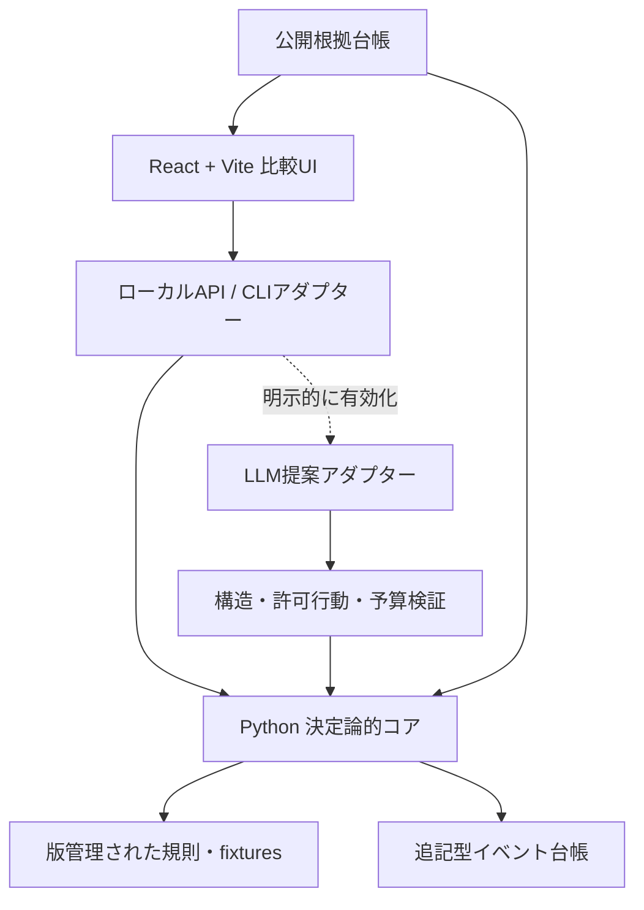

# アーキテクチャ

## 方針

初期MVPは、Pythonの決定論的シミュレーションコア、JSONのイベント台帳、React + Viteの
比較UIを分離する。現在は設計のみで、フレームワークや実行環境はまだ導入していない。



## コンポーネント境界

### 決定論的コア

状態schema、行動制約、更新式、seed付き外生イベントを所有する。ネットワークやLLMに依存せず、
fixtureだけで再生できることを最初の実装条件とする。

### LLM提案アダプター

MVP必須ではない。導入時は単一エージェントから始め、交渉案と理由を構造化出力で返す。
ファイル、shell、外部送信、状態の直接変更権限は持たせない。API keyはブラウザへ置かず、
ローカルまたはサーバー側の環境変数から読む。実行前に利用者が明示的に有効化する。

### イベント台帳

追記型JSON Linesを想定する。人間向け要約とは別に、入力、規則、差分、棄却、証拠参照を保持する。
LLMの文章は証拠参照を代替しない。

### 比較UI

三分岐、六観測軸、モデル内因果トレース、証拠分類を表示する。表示状態がシミュレーション状態を
暗黙に変更しないよう、読み取りと実行操作を分離する。

## 想定ディレクトリ

```text
src/
  sim/          # Python core, schemas, rules
  adapters/     # CLI, local API, optional LLM
  web/          # React + Vite UI
data/
  fixtures/     # public, synthetic inputs
  runs/         # ignored local run outputs
tests/
docs/
```

実装時にrepoのpackage構成を確定し、この案と異なる場合はADRを更新する。

## 品質境界

- schema validation、property test、replay testをコアに置く
- UIはキーボード操作、見出し構造、色以外の識別、reduced motionを満たす
- 外部URL、論文要約、LLM出力を未信頼入力として扱う
- CIはsecret scan、tracked-and-ignored検査、Markdown link、unit test、buildを段階的に追加する
