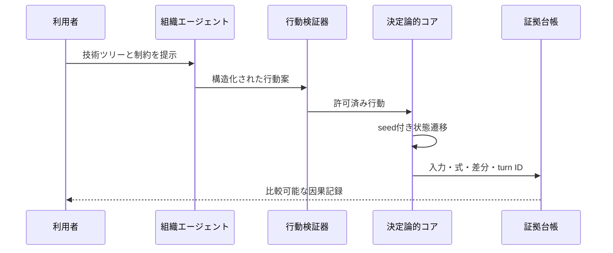

# シミュレーション設計

## 一つの事件

2026年、予算、人材、重要部品の制約により、日本は月面技術の追加重点枠を今後10年間、
一つの技術ツリーへ集中させる。これは実在する政府決定ではなく、現実の政策・事業を入力にした
シナリオ仮説である。

## 状態とラウンド

同じ`scenario_snapshot_id`と`seed`から、国際統合型、国内自立型、開放基盤型を分岐する。
ラウンドは`2026`、`2030`、`2035`、`2040`の4つとする。

三分岐は同じ`scenario_snapshot_hash`、`seed`、`model_version`、`event_stream_hash`を共有する。
最初の技術ツリーと、その選択から因果的に生じる行動・状態だけをbranch間で変える。

```text
scenario_snapshot_id
seed
branch_id
round
agent_states[]
capabilities{}
dependencies{}
norms{}
public_legitimacy
evidence_refs[]
events[]
unknowns[]
```

## 探索的・逐次更新型の意思決定ループ

本シミュレーションは単一未来の予測器ではなく、探索的モデリングとして運用する。

1. **Observe**: review時点の公開事実、モデル仮定、未知を版管理されたsnapshotへ固定する。
2. **Bound**: 有限の因子と離散状態を定義し、整合しない組合せを根拠付きで除外する。
3. **Screen**: 因子スクリーニングで、影響が小さい候補を予備選別する。
4. **Explore**: 三分岐を同一条件で実行し、六軸、脆弱性、後悔、選択肢喪失を比較する。
5. **Decide**: 人間が直近の一手と切替条件を選ぶ。単一スコアで自動決定しない。
6. **Record**: manifest、event log、model card、feedbackを追記し、旧runを上書きしない。
7. **Replan**: 次のreview時点で観測を更新し、残りhorizonを再評価する。

これはモデル予測制御（MPC）に着想を得た逐次更新型の適応計画である。数理状態方程式、目的関数、
制約付き最適化、安定性を実装するまではMPCそのものと呼ばない。詳細は
[`ADR-0005`](adr/0005-adaptive-exploratory-decision-loop.md)を参照する。

組合せ爆発を避けるため、出力の六観測軸を早期に一つへ圧縮しない。入力側を有限領域化し、
因子スクリーニングの後にscenario discoveryを行う。除外した因子、理由、感度範囲はmodel cardへ残す。

数値は事実値ではない。初期値、単位、範囲、根拠、更新式、感度をモデルカードへ記録して初めて
利用できる。根拠のない精密な小数は使わない。

## エージェント

粒度は「意思決定する組織」に揃える。

1. 日本の政策・資金配分主体
2. 大型探査プロジェクトを担う国内連合
3. 月面輸送・部品を担う新興企業連合
4. 大学・研究機関・次世代技術者の連合
5. アルテミスの国際協力パートナー群

各エージェントは公開された制度上の役割、シナリオ内の選好、利用可能な行動を別フィールドで持つ。
実在組織の非公開意図や人物像は割り当てない。

## 行動

各ラウンドで選べる行動は、資金配分、共同研究、調達、標準提案、知財公開、技能育成、
国際協力、冗長化である。行動には予算・人材・時間の上限を置き、同時にすべてを最大化できない。

## 状態遷移

決定論的コアが、入力状態、選択された行動、seed付き外生イベントから次状態を計算する。
LLMは交渉案、選択理由、意味層の解釈候補を構造化形式で提案できるが、状態を直接書き換えない。
提案は許可された行動へ変換され、検証後にコアが適用する。



## 観測軸

到達・運用、産業再生産、ルール形成、知識継承、関係選択、公的正統性の六軸を別々に表示する。
一つの総合「文明スコア」は作らない。必要な場合でも利用者が明示した重みを併記し、重みを変えた
感度分析と元の六軸を常に残す。

## イベント台帳

各イベントは`turn_id`、時点、主体、入力、行動、前状態、後状態、適用規則、乱数draw、
証拠参照、分類、反実仮想リンクを持つ。分類は`fact`、`scenario_hypothesis`、
`model_assumption`、`llm_proposal`、`unknown`のいずれかとする。

## 再現性

- snapshot、seed、モデル版、prompt版、入力資料のhashを保存する
- 三分岐では外生イベント列を共有する
- LLM応答の原文、構造化後の行動、棄却理由を分けて保存する
- 同じ入力で決定論的コアの状態差分が一致するテストを置く
- モデル変更後の結果を以前の結果へ上書きしない

## 未知と反証

技術成熟速度、実際の予算、エージェント選好、因果係数、国際環境は未知である。各仮定には、
反証に必要なデータ、感度を確認する範囲、結果に与える向きを記録する。結末より先に、結末が
どの未知に依存するかを表示する。

各評価runのfeedbackは`owner`、`decision`、`next_action`、`resume_condition`、`evidence`を持つ。
検査失敗は説明文だけで閉じず、model card、fixture、test、ADR、または`PROJECT_GOAL.md`の契約へ戻す。
